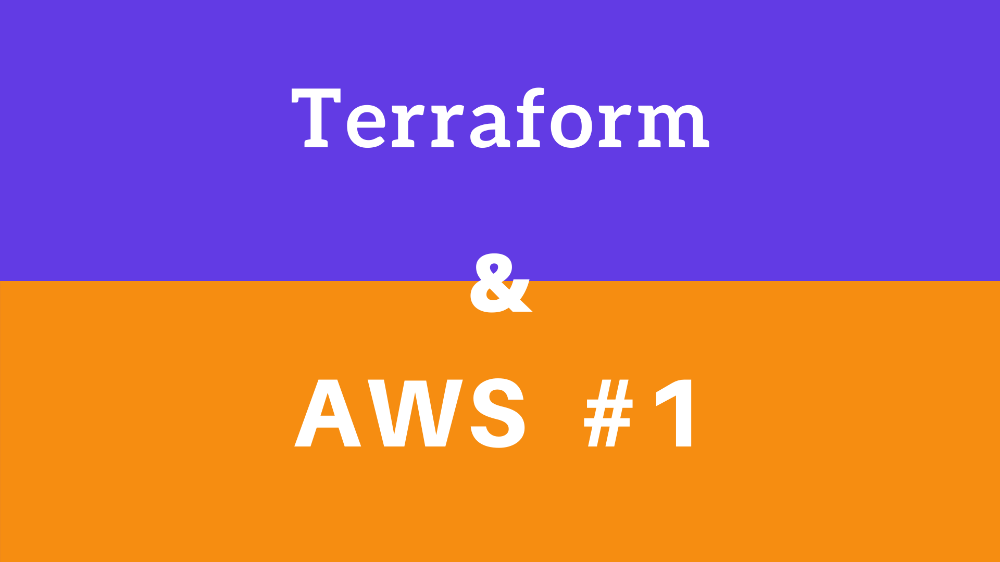
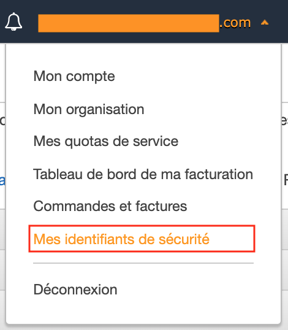
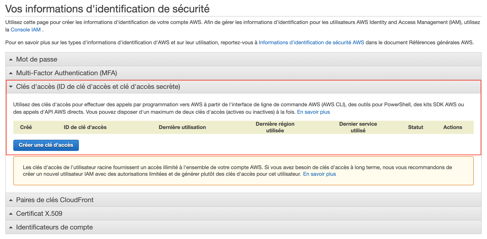
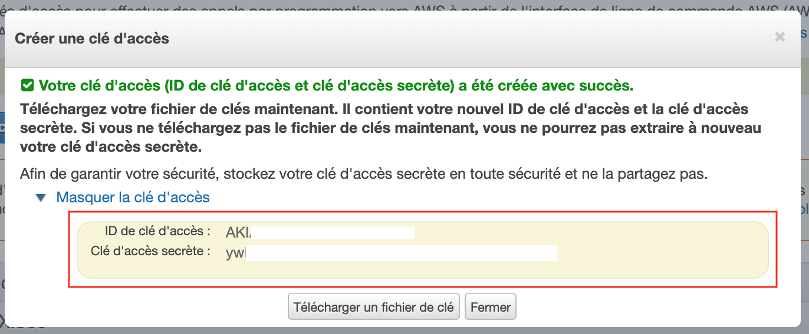
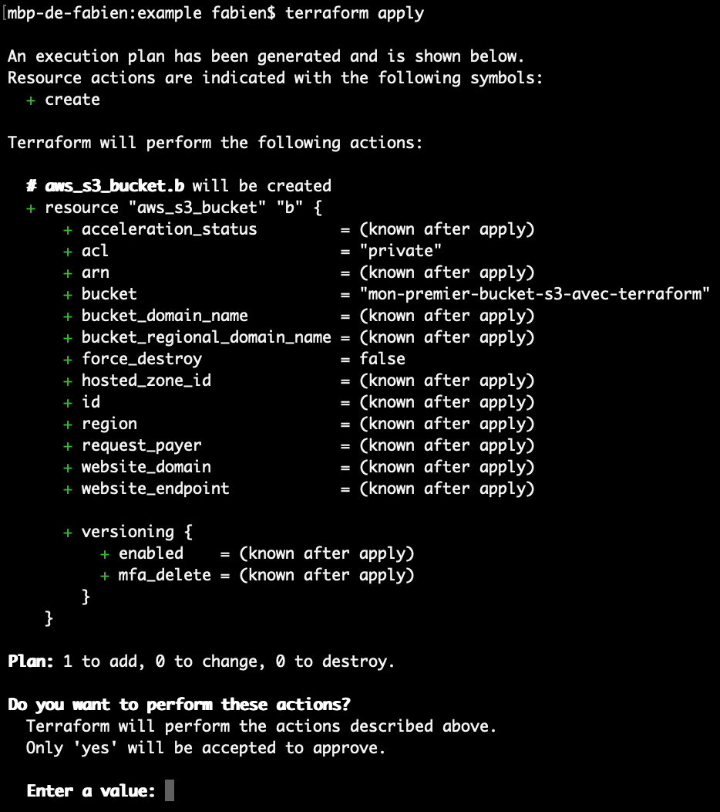
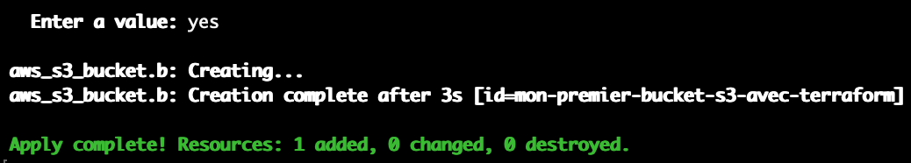
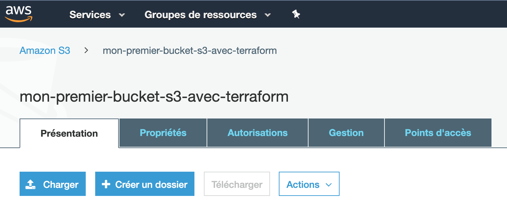
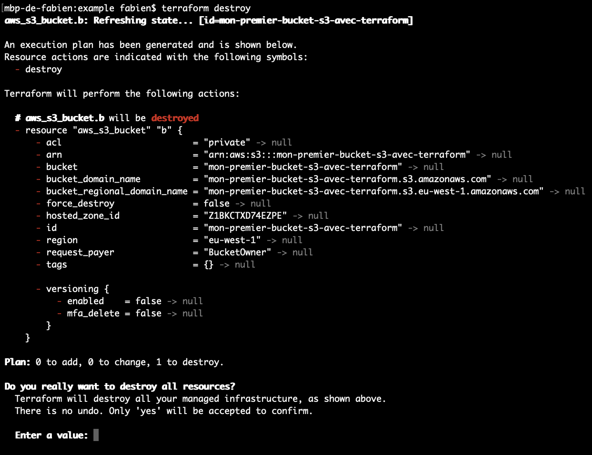
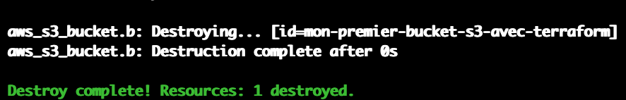
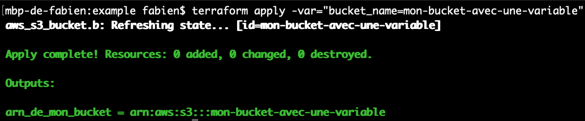

# Introduction à Terraform & AWS

## Qu'est ce que Terraform et l'IAC?
Terraform est un programme open source, édité et développé en Go par HashiCorp, permettant de créer et "gérer" son infrastructure avec du code, on parle d'IAC (Infrastructure As Code).

Terraform est compatible avec les clouds publics les plus populaires : AWS, Google Cloud, Azure ... L'outil utilise les SDKs des différents providers pour gérer les infrastructures

Avec cet outil, on décrit, dans des fichiers de configurations, l'infrastructure attendue, Terraform s'occupe de créer / modifier / supprimer les briques dans l'ordre qu'il faut et de gérer les dépendances.

Utiliser du code pour gérer son infrastructure c'est d'avoir tous les "bénéfices du code" ; 
- versionner le code, le partager, le dupliquer ...
- automatiser son execution et donc automatiser le déploiement de son infrastructure.
- limiter les erreurs humaines en utilisant, manuellement, l'interface web des divers providers.
- dupliquer efficacement l'infrastructure d'un environnement à l'autre.

## Terraform

### Installation && génération des identifiants AWS
Dans un premier temps il faut télécharger le package correspondant à votre système d'exploitation : https://www.terraform.io/downloads.html

Dans un second temps vous devez rendre disponible le binaire dans votre **PATH**

> 💡Pour plus d'informations : [documentation sur l'installation](https://learn.hashicorp.com/terraform/getting-started/install.html)

Nous allons utiliser Terraform avec le provider AWS, afin de pouvoir continuer, il faut générer des identifiants AWS (un compte AWS est requis).

Pour générer des identifiants, une fois connecté sur aws, il faut se rendre, dans le menu déroulant (en dessout du nom de compte), sur *Mes identifiants de sécurité*.



Il faut ensuite se rendre sur *Clés d'accès* et cliquer sur *Générer une clé d'accès*.





Vous obtenez alors l'id et la clé d'accès secrète dont on a besoin pour utiliser Terraform sur l'environnement AWS.

L'id de clé d'accès correspond à l'**access_key** et la clé d'accès decrète correspond à la **secret_key**.

Ces identifiants peuvent être renseignés directement dans le bloc **provider** mais c'est fortement déconseillé, en cas de commit,  vous partagerez vos identifiants.

Personnellement, j'ai choisi de mettre mes identifiants AWS dans un fichier **credentials** dans le dossier **.aws** à la racine de mon dossier utilisateur.

**/Users/fabien/.aws**

```
[default]
aws_access_key_id=MONACCESSKEYID
aws_secret_access_key=MASECRETACCESSKEYAWS
```

> 💡Pour plus d'informations : [documentation sur les identifiants](https://www.terraform.io/docs/providers/aws/index.html#authentication)

### La syntaxe
Le langage Terraform a sa propre syntaxe, celle-ci ressemble un peu au JSON. 

Globalement toutes les instructions se trouvent à l'intérieur de différents blocs délimités par des `{}`. Les blocs parents sont précédés par un type et un id permettant de les identifiers et de les liers.

Les fichiers portent l'extension **.tf**

> 💡Pour plus d'informations : [documentation sur la syntaxe](https://www.terraform.io/docs/configuration/syntax.html)

### Provider
L'élément **provider** permet ratacher un provider cloud ; AWS, Google Cloud, Azure .. à ses fichiers de configurations Terraform.

Voici un exemple d'un **provider** (ici avec AWS)
```
provider "aws" {
  region     = "us-west-2"
  access_key = "my-access-key"
  secret_key = "my-secret-key"
}
```

Définir un provider permet également d'utiliser les ressources associées au provider choisit.

> Il aussi possible d'utiliser plusieurs providers, voir la [documentation sur les providers](https://www.terraform.io/docs/configuration/providers.html)

### Ressource 
Les briques d'une infrastructure sont représentées par l'élément **ressource**. 

Une ressource comporte un **type**, un **nom** et une liste d'attributs dont certains peuvent être optionnels.

Le type d'une ressource correspond à un élement au sein du provider choisi (aws_vpc, aws_cloudwatch_dashboard, aws_lambda_function ...).

```
resource "type_ressource" "nom_ressource" {
    attribut1 = "valeur1"
    attribut2 = "valeur2"
    attribut3 = "valeur3"
}
```

Les ressources peuvent faire reférences à d'autres ressources afin de récupérer une valeur d'un attribut ;

```
resource "type_ressource_a" "ma_ressource_a" {
    attribut1 = "valeur1"
    attribut2 = "valeur2"
    attribut3 = "valeur3"
}

resource "type_ressource_b" "ma_ressource_b" {
    attribut1 = type_ressource_a.ma_ressource_a.attribut2
}
```

> 💡Pour plus d'informations : [documentation sur les ressources](https://www.terraform.io/docs/configuration/resources.html)

### Data
L'élément **data** s'apparente à l'élement **ressource** ; si on utilise **ressource** pour créer / modifier / supprimer l'infra, l'élément **data** est utilisé pour récupérer des données sur de l'infrastructure déjà existante. **data** peut prendre, en attribut, des filtres pour de la recherche.

```
data "type_ressource_a" "data_ressource_a" {
  filter {
    name   = "le nom que je recherche"
  }

  most_recent = true
}
```

On peut ensuite utiliser cette référence avec les ressources.

```
data "type_ressource_a" "data_ressource_a" {
  filter {
    name   = "le nom que je recherche"
  }

  most_recent = true
}

resource "type_ressource_b" "ma_ressource_b" {
    attribut1 = type_ressource_a.data_ressource_a.name
}
```

> 💡Pour plus d'informations : [documentation sur les datas](https://www.terraform.io/docs/configuration/data-sources.html)

### La création, modification et destruction
Terraform permet de créer l'infra, de la modifier mais aussi de la supprimer.

Pour cela il y a deux commandes essentielles; `terraform apply` et `terraform destroy`

La première se charge d'appliquer les terraforms ; cette commande s'occupe de modifier l'infra existante afin d'obtenir la configuration demandée.

Regardons ce que ça donne concrétement, nous allons simplement créer un Bucket S3 :

```
# dans un fichier main.tf (ceci est un commentaire)

provider "aws" {
  profile = "default"
  region  = "eu-west-1"
}

resource "aws_s3_bucket" "b" {
  bucket = "mon-premier-bucket-s3-avec-terraform"
  acl    = "private"
}
```

Au sein du dossier il faut exécuter la commande `terraform init`, cette commande permet d'initialiser le répertoire de travail Terraform en téléchargant les ressources dédiés pour le provider indiqué.

#### Terraform apply
Vous pouvez maintenant executer `terraform apply`



Terraform procède à une analyse des fichiers **.tf** et vous affiche l'ensemble des actions qu'il y a à effectuer afin d'obtenir la configuration décrite.

Vous devez approuver manuellement ces actions en écrivant **yes**, vous pouvez aussi utiliser `terraform apply -auto-approve` afin de passer cette étape de confirmation.



Féliciation, votre Bucket S3 vient d'être créé.

> Il faut savoir qu'un Bucket S3 est identifié via son nom, et cet identifiant doit être **unique au monde**, il ce peut donc qu'il faille changer le nom du S3 si celui-ci est déjà utilisé.

Vous pouvez le retrouver via l'interface web AWS :



Si vous essayez d'exécuter du nouveau la commande `terraform apply` rien ne sera modifié puisque les descriptions des ressources présentes dans le fichier correspondent à l'infrastructure existante.

#### Terraform destroy
Pour détruire la configuration Terraform, précédemment appliquer et "construite", il faut utiliser `terraform destroy`.



Tout comme la commande terraform apply, il faut confirmer l'action avec **yes** ou utiliser l'option `-auto-aprove`.



Le Bucket S3 a été supprimé.

### Gérer les variables
Voici comment définir un bloc pour une variable :

```
variable "ma_variable" {
  type = string
  description = "description de ma variable"
  default = ""
}
```

Il est possible de lui définir un type, une description ainsi qu'une valeur pas défaut.

Il y a plusieurs façons d'attribuer une valeur à une variable ;
- par interaction lors de l'execution de la commande `terraform apply`
- directement en ligne de commande : `terraform apply -var="ma_variable=toto"`
- avec un fichier **terraform.tfvars**
- en variable d'envrionnement `export TF_VAR_ma_variable=toto`

Variabilisons le nom du Bucket S3 *(cf : l'exemple précédant)*

```
# dans un fichier main.tf (ceci est un commentaire)

provider "aws" {
  profile = "default"
  region  = "eu-west-1"
}

variable "bucket_name" {
  type = string
  description = "Nom du bucket S3"
}

resource "aws_s3_bucket" "b" {
  bucket = var.bucket_name
  acl    = "private"
}
```

En exécutant le commande `terraform apply -var="bucket_name=mon-bucket-avec-une-variable"` la création du bucket sera effective et le S3 prendra le nom de "mon-bucket-avec-une-variable".

> 💡Pour plus d'informations : [documentation sur les variables](https://www.terraform.io/docs/configuration/variables.html)

### Output
L'élément **output** permet de retourner / afficher des valeurs de l'infrastructure. Tous les attributs d'une ressource sont retournable. Il est par exemple possible de retourner l'identifiant d'une ressource.

```
output "nom_de_mon_output" {
  value = type_ressource.ma_ressource.attribut1
}
```
Utilisation de l'éléement **output** afin d'afficher l'arn du bucket s3 :

```
output "arn_de_mon_bucket" {
  value = aws_s3_bucket.b.arn
}
```

Voici l'affichage lors de l'execution de `terraform apply -var="bucket_name=mon-bucket-avec-une-variable` :



> 💡Pour plus d'informations : [documentation sur les outputs](https://www.terraform.io/docs/configuration/outputs.html)

### La gestion des états
Au sein des fichiers *.tfstate* Terraform stock l'état de la configuration, l'état de l'infrastructure existante et plusieurs méta-données.

Par défaut ces fichiers sont stockés en local mais il est possible de stocker l'état à distance, via un Backend S3 par exemple.

Il est recommandé, lors du travail en équipe, de stocker à distance les fichiers *.tfstate* afin de partager et de synchroniser le même état.

> 💡Pour plus d'informations : [documentation sur les états](https://www.terraform.io/docs/state/index.html)

## Conclusion 
J'ai essayé de vous présenter, au mieux, une introduction à Terraform, en vous donnant les clés pour comprendre le fonctionnement de base.

Cependant Terraform regorge de fonctionnalités qui sont à creuser et à découvrir. N'hésitez, pour chaque partie, à vous documenter plus amplement sur le site de Terraform.

Je vous ferais rapidement un retour d'expérience sur Terraform et AWS ainsi que posts sur des petits Tips TF 😉

